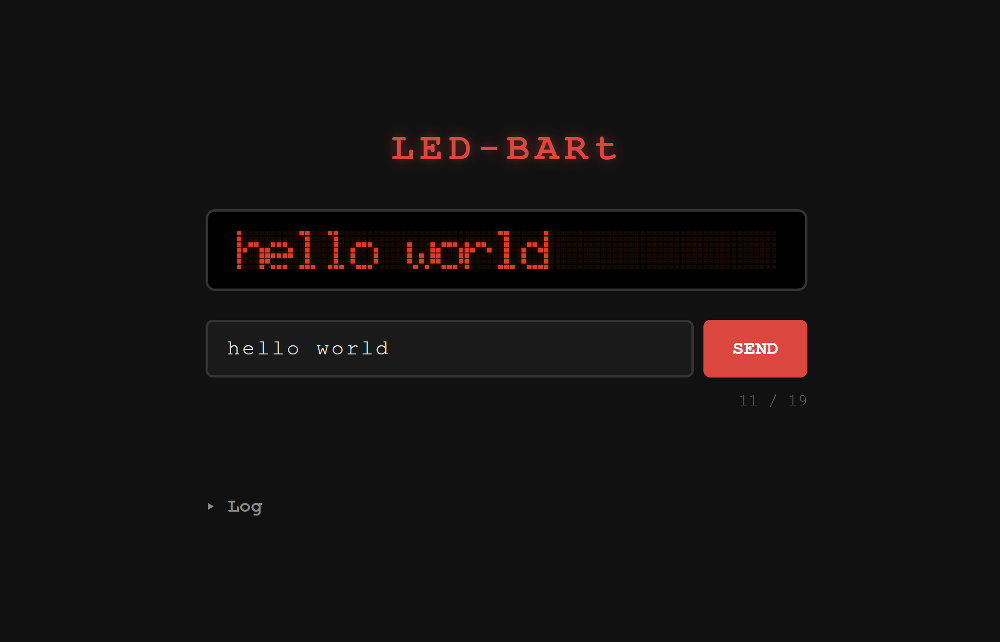

# LED BARt

WiFi-connected LED bar display for the hackerspace.

## Architecture

```
LAN
 │
 ▼
Xiao ESP32-C3          Arduino Uno
┌─────────────┐  UART  ┌──────────────┐
│  WiFi/HTTP  │──────▶ │  LED bar     │
│  webserver  │  9600  │  controller  │
│  3.3V logic │  baud  │  5V logic    │
└─────────────┘        └──────────────┘
```

**Why two chips?** The LED bar needs 5V logic — the Arduino Uno provides that. The ESP32-C3 handles WiFi/Bluetooth but runs at 3.3V, so it can't drive the bar directly. They communicate over UART.

## Web Interface

Live at https://0x20.github.io/LED-BARt/



The `website/` folder contains a web frontend with a live pixel-accurate preview using the same 5x7 font as the hardware. Serve it from any machine on the LAN and configure a reverse proxy to forward `/text` and `/log` to the ESP32.

## Usage

Send text to the display via the web interface or directly:

```bash
curl -X POST http://ledbart.local/text -H "Content-Type: text/plain" -d "HELLO WORLD"
```

Reachable via mDNS at `ledbart.local`. The IP is also printed to Serial (115200 baud) on boot.

Max 19 characters — longer text is truncated, shorter is padded with spaces.

## Wiring

| ESP32-C3 | Arduino Uno |
|----------|-------------|
| D6 (TX)  | pin 0 (RX)  |
| GND      | GND         |

> Disconnect the wire from Uno pin 0 before uploading a sketch, reconnect after.

## Scripts

| Folder | Chip | Role |
|--------|------|------|
| `scripts/led_bart_esp32c3_webserver/` | Xiao ESP32-C3 | HTTP → UART bridge + mDNS (`ledbart.local`) |
| `scripts/led_bart_arduino_uno_uart_display/` | Arduino Uno | UART → LED bar driver (active) |
| `scripts/font_preview.py` | — | Preview 5x7 font glyphs in the terminal |
| `scripts/legacy/led_bart_arduino_uno_og/` | Arduino Uno | original reference code |
